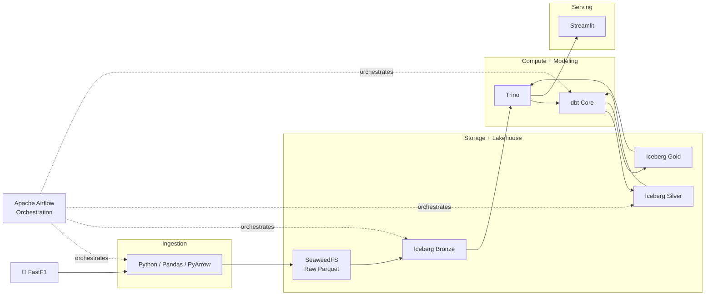
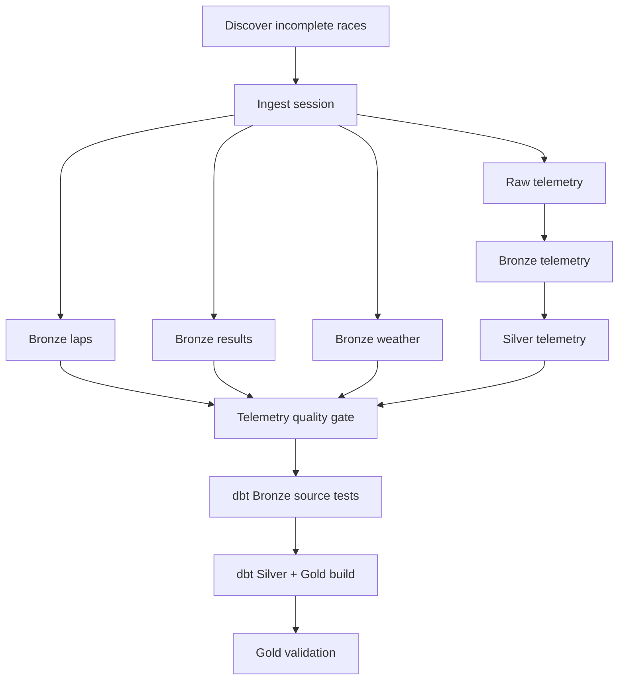

<div align="center">

# 🏎️ F1 Lakehouse

### From race telemetry to a replayable, tested lakehouse

**FastF1 → SeaweedFS → Apache Iceberg → Trino → dbt → Airflow → Streamlit**

[](#cold-start-recovery-test)
[](https://airflow.apache.org/)
[](https://iceberg.apache.org/)
[](https://trino.io/)
[](https://www.getdbt.com/)
[](https://www.python.org/)
[](https://podman.io/)

</div>

---

## What this project is

**F1 Lakehouse** is an end-to-end data engineering project built around Formula 1 race and telemetry data.

It is intentionally more than a dashboard. The project focuses on the engineering problems behind a trustworthy analytics platform:

- replayable ingestion
- S3-compatible object storage
- Apache Iceberg table management
- Bronze / Silver / Gold modeling
- dynamic season orchestration
- high-volume telemetry processing
- data-quality gates
- idempotent reprocessing
- incomplete-race discovery
- concurrency control
- recovery from an empty analytical catalog
- local infrastructure resource management

The current pipeline has been tested by **dropping every Bronze, Silver, and Gold table and rebuilding the lakehouse end-to-end from the preserved Raw layer**.

> **Cold-start result:** 14 completed races discovered, rebuilt, validated, and returned to **14/14 fully processed**.

---

## Why this project stands out

Most F1 projects begin with a CSV and end with a chart.

This one asks a different question:

> **What would the data platform behind the chart need to look like?**

| Engineering problem | Implementation |
|---|---|
| Reprocessing without redownloading source data | Immutable/replayable Raw Parquet in SeaweedFS |
| Analytical table management | Apache Iceberg |
| SQL over lakehouse data | Trino |
| Transformation and tests | dbt Core |
| Multi-race orchestration | Apache Airflow dynamic task mapping |
| Partial telemetry detection | Expected-vs-actual driver reconciliation |
| Drivers with zero race laps | Explicit telemetry eligibility rules |
| Concurrent Iceberg commits | Serialized same-table writers |
| Trino instability under heavy telemetry work | Container, JVM, query-memory limits |
| Empty catalog / disaster-style rebuild | Cold-start-aware discovery and table creation |

---

# Architecture



### Technology stack

| Area | Technology |
|---|---|
| Source | FastF1 |
| Ingestion | Python, Pandas, PyArrow |
| Raw storage | SeaweedFS S3-compatible storage |
| File format | Parquet |
| Table format | Apache Iceberg |
| Iceberg catalog | SeaweedFS Iceberg REST catalog |
| SQL engine | Trino |
| Transformations | dbt Core + dbt-trino |
| Orchestration | Apache Airflow |
| Metadata database | PostgreSQL |
| Containers | Podman + Compose |
| Serving | Streamlit |

---

# Pipeline at a glance

```text
FastF1
  │
  ▼
Python ingestion
  │
  ▼
SeaweedFS / f1-raw
  │
  ├── laps.parquet
  ├── results.parquet
  ├── weather.parquet
  ├── metadata.json
  └── telemetry/driver=...
  │
  ▼
┌──────────────────────────────┐
│        BRONZE / ICEBERG      │
│ laps                         │
│ results                      │
│ weather                      │
│ telemetry                    │
└──────────────────────────────┘
  │
  ▼
┌──────────────────────────────┐
│        SILVER / ICEBERG      │
│ silver_laps                  │
│ silver_results               │
│ silver_weather               │
│ silver_telemetry             │
└──────────────────────────────┘
  │
  ▼
dbt transformations + tests
  │
  ▼
┌──────────────────────────────┐
│         GOLD / ICEBERG       │
│ race_driver_performance      │
│ lap_telemetry_metrics        │
└──────────────────────────────┘
  │
  ▼
Trino
  │
  ▼
Streamlit
```

---

# Current milestone

The current 2026 test dataset has:

| Metric | Status |
|---|---:|
| Completed races discovered | **14** |
| Fully processed races | **14 / 14** |
| Canonical Iceberg tables | **10** |
| Bronze tables | **4** |
| Silver tables | **4** |
| Gold tables | **2** |
| Full cold rebuild | **PASS** |

The important part is not simply that the data exists.

The pipeline can determine **what is missing**, rebuild only what is required during normal operation, and recover the entire analytical lakehouse from Raw when the catalog is cleared.

---

# Lakehouse layers

## Raw — replayable landing zone

Raw data is stored in SeaweedFS using its S3-compatible API.

```text
f1-raw/
└── season=2026/
    └── event=canadian-grand-prix/
        └── session=R/
            ├── laps.parquet
            ├── results.parquet
            ├── weather.parquet
            ├── metadata.json
            └── telemetry/
                ├── driver=ANT/
                ├── driver=HAM/
                └── ...
```

The Raw layer is intentionally retained so downstream Iceberg tables can be recreated without having to reacquire the source data.

---

## Bronze — normalized source data

```text
iceberg.bronze.laps
iceberg.bronze.results
iceberg.bronze.weather
iceberg.bronze.telemetry
```

Bronze keeps the data close to the source while enforcing explicit schemas and standardized metadata.

Because every race writes into shared Iceberg tables, Airflow serializes writers to the same table:

```python
@task(
    max_active_tis_per_dag=1
)
```

This prevents simultaneous mapped tasks from racing to create or commit to the same Iceberg table.

---

## Silver — validated analytical data

```text
iceberg.silver.silver_laps
iceberg.silver.silver_results
iceberg.silver.silver_weather
iceberg.silver.silver_telemetry
```

Silver is where source-oriented records become analysis-ready datasets.

Telemetry includes fields such as:

```text
season
event_name
event_slug
session_type
driver_code
driver_number
team_name
lap_number
sample_timestamp_utc
session_time_ms
rpm
speed_kph
gear
throttle_pct
brake
drs
x / y / z
distance
relative_distance
driver_ahead
distance_to_driver_ahead
source
status
source_system
ingested_at
```

---

## Gold — analytics-ready marts

```text
iceberg.gold.race_driver_performance
iceberg.gold.lap_telemetry_metrics
```

### `race_driver_performance`

Race/driver analytical mart combining classification, race pace, fastest-lap information, tyre-related metrics, and weather context.

### `lap_telemetry_metrics`

Telemetry aggregated to:

```text
season
event_slug
session_type
driver_code
lap_number
```

The model also reconciles telemetry against lap records using statuses such as:

```text
MATCHED_WITH_LAP_TIME
MATCHED_NO_LAP_TIME
NO_LAP_RECORD
```

This gives the serving layer a much smaller and more useful analytical grain than repeatedly scanning high-frequency telemetry samples.

---

# Airflow orchestration

The main DAG is:

```text
f1_season_pipeline
```

It is parameterized by:

```text
year
session
start_round
end_round
```

and uses **dynamic task mapping** so the number of races processed depends on discovery.



The DAG also uses:

```python
max_active_runs=1
```

to prevent overlapping season runs.

---

# Intelligent race discovery

`src/common/find_missing_races.py` checks whether each completed race has the required downstream state.

It does not rely only on table existence.

For telemetry it compares:

```text
expected drivers from Bronze laps
            vs
drivers present in Bronze telemetry
            vs
drivers present in Silver telemetry
```

This catches **partial race loads** that would otherwise look complete just because an `event_slug` exists.

Example healthy result:

```text
Completed races : 14
Incomplete      : 0
Fully processed : 14
```

---

# Telemetry edge cases

## Driver listed in results but no race laps

A driver can appear in session results while having no race lap rows.

That driver is not telemetry-eligible.

Example:

```text
Session drivers   : 22
Eligible drivers  : 21
Drivers processed : 21/21
Skipped no laps   : 1
```

This distinction matters:

```text
0 FastF1 race laps
    → valid skip

1+ FastF1 race laps but zero telemetry
    → pipeline failure
```

That keeps the quality gate strict without incorrectly failing valid sessions.

---

# Cold-start recovery test

This is the strongest end-to-end test currently implemented.

All registered Bronze, Silver, and Gold tables are removed while the Raw layer remains intact.

```text
Raw data retained
      │
      ▼
Drop all 10 analytical Iceberg tables
      │
      ▼
Discovery sees 14 incomplete races
      │
      ▼
Airflow rebuilds Bronze
      │
      ▼
Telemetry completeness validation
      │
      ▼
Build Silver
      │
      ▼
dbt source tests
      │
      ▼
Build Gold
      │
      ▼
Gold validation
      │
      ▼
14 / 14 fully processed
```

### Result

```text
Completed races : 14
Incomplete      : 0
Fully processed : 14
```

**Status: ✅ PASS**

This validates:

- Raw replayability
- missing-table discovery
- cold table creation
- Iceberg catalog registration
- multi-race orchestration
- telemetry completeness checks
- no-lap-driver handling
- same-table commit serialization
- Silver rebuilds
- dbt source tests
- Gold model creation
- final quality validation

<details>
<summary><strong>Cold rebuild table-drop commands</strong></summary>

> Do not manually delete registered Iceberg table directories from SeaweedFS. Drop tables through Trino.

```sql
DROP TABLE IF EXISTS iceberg.gold.lap_telemetry_metrics;
DROP TABLE IF EXISTS iceberg.gold.race_driver_performance;

DROP TABLE IF EXISTS iceberg.silver.silver_telemetry;
DROP TABLE IF EXISTS iceberg.silver.silver_laps;
DROP TABLE IF EXISTS iceberg.silver.silver_results;
DROP TABLE IF EXISTS iceberg.silver.silver_weather;

DROP TABLE IF EXISTS iceberg.bronze.telemetry;
DROP TABLE IF EXISTS iceberg.bronze.laps;
DROP TABLE IF EXISTS iceberg.bronze.results;
DROP TABLE IF EXISTS iceberg.bronze.weather;
```

</details>

---

# Trino hardening

High-volume telemetry transformations exposed memory pressure during full-season rebuilding.

The local environment was hardened at three levels.

### Container

```yaml
mem_limit: 6g
```

### JVM

```text
-Xms1G
-Xmx4G
```

### Query limits

```properties
query.max-memory-per-node=1500MB
query.max-memory=1500MB
query.max-total-memory=2GB
memory.heap-headroom-per-node=1GB
```

Silver telemetry tasks are also serialized to avoid stacking several heavy transformations against the single-node Trino deployment.

---

# Screenshots

## Orchestration

Airflow drives ingestion, promotion, validation, and dbt execution.

<p align="center">
  
</p>

<p align="center">
  
</p>

## Storage and lakehouse

<p align="center">
  
</p>

<p align="center">
  
</p>

## SQL and Gold analytics

<p align="center">
  
</p>

<p align="center">
  
</p>

## Streamlit

<p align="center">
  
</p>

<p align="center">
  
</p>

---

# Repository layout

```text
f1-lakehouse/
├── airflow/
│   └── dags/
│       └── f1_season_pipeline.py
├── app/
│   ├── main.py
│   └── pages/
├── configs/
│   ├── dbt/
│   └── trino/
│       ├── catalog/
│       ├── config.properties
│       └── jvm.config
├── dbt/
│   ├── macros/
│   ├── models/
│   │   ├── bronze/
│   │   ├── silver/
│   │   └── gold/
│   └── tests/
├── docker/
│   └── airflow/
├── docs/
│   └── screenshots/
├── src/
│   ├── common/
│   ├── iceberg/
│   ├── ingestion/
│   └── validation/
├── compose.yaml
├── requirements.txt
└── README.md
```

---

# Running locally

## Prerequisites

You need:

- Podman
- Podman Compose
- Git
- enough local memory for the Airflow + Trino + SeaweedFS stack

Clone the project:

```bash
git clone https://github.com/RobertTarus/f1-lakehouse.git
cd f1-lakehouse
```

Configure the environment variables required by `compose.yaml`, then start the platform:

```bash
podman compose up -d
```

Check services:

```bash
podman compose ps
```

Core services include:

```text
f1-seaweedfs
f1-trino
f1-airflow-api-server
f1-airflow-scheduler
f1-airflow-dag-processor
f1-airflow-postgres
```

### Local service ports

| Service | Local endpoint |
|---|---|
| Airflow | `http://localhost:8082` |
| Trino | `http://localhost:8081` |
| SeaweedFS S3 | `http://localhost:8333` |
| SeaweedFS Filer | `http://localhost:8888` |
| SeaweedFS Master | `http://localhost:9333` |
| Iceberg REST catalog | `http://localhost:8181` |
| SeaweedFS Admin | `http://localhost:23646` |

---

# Running the season pipeline

Trigger:

```text
f1_season_pipeline
```

Example parameters:

```json
{
  "year": 2026,
  "session": "R",
  "start_round": 1,
  "end_round": 99
}
```

The DAG discovers and processes only races that require work.

---

# Validate completeness

```bash
podman exec -it f1-airflow-scheduler bash -lc '
cd /opt/airflow/project &&
/opt/airflow/venvs/pipeline/bin/python \
src/common/find_missing_races.py \
--year 2026 \
--session R
'
```

Healthy result:

```text
Completed races : 14
Incomplete      : 0
Fully processed : 14
```

---

# Query the lakehouse

List all canonical analytical tables:

```bash
podman exec -it f1-trino trino --execute "
SELECT
    table_schema,
    table_name
FROM iceberg.information_schema.tables
WHERE table_schema IN ('bronze', 'silver', 'gold')
ORDER BY table_schema, table_name;
"
```

Expected:

```text
bronze.laps
bronze.results
bronze.telemetry
bronze.weather

silver.silver_laps
silver.silver_results
silver.silver_telemetry
silver.silver_weather

gold.lap_telemetry_metrics
gold.race_driver_performance
```

Example Gold query:

```sql
SELECT
    season,
    event_slug,
    driver_code,
    lap_number,
    avg_speed_kph,
    max_speed_kph
FROM iceberg.gold.lap_telemetry_metrics
WHERE season = 2026
ORDER BY event_slug, driver_code, lap_number
LIMIT 50;
```

---

# Data-quality strategy

| Stage | Checks |
|---|---|
| Raw | expected objects, readable Parquet, session metadata |
| Bronze | normalized schema, race metadata, driver coverage |
| Telemetry | expected vs actual drivers, lap coverage, no-lap handling |
| dbt | source tests, Silver/Gold model tests |
| Gold | grain/reconciliation validation |

The goal is to make pipeline success mean more than **"the task exited with code 0."**

---

# Engineering lessons captured in the project

### 1. Table existence is not data completeness

A race can exist in a table and still be missing one driver.

Discovery therefore checks the actual driver set.

### 2. Retries require idempotent writes

A data pipeline should be safe to rerun after failure.

Raw is preserved and downstream processing targets logical partitions rather than blindly duplicating data.

### 3. Dynamic task mapping creates real concurrency problems

Mapped races originally attempted to create/update the same Iceberg tables simultaneously.

Same-table writers are now serialized while unrelated work can still proceed concurrently.

### 4. Source systems contain legitimate edge cases

A driver appearing in results does not guarantee that the driver completed a race lap.

Telemetry validation models that distinction explicitly.

### 5. Local infrastructure still needs capacity planning

A single-node Trino deployment can be overwhelmed by concurrent telemetry transformations.

JVM, container, query, and orchestration limits are part of the platform design.

---

# Roadmap

Next engineering iterations:

- [ ] GitHub Actions CI
- [ ] automated unit/integration tests in CI
- [ ] Iceberg maintenance and compaction
- [ ] automated ingestion as new races become complete
- [ ] historical season backfills
- [ ] richer dbt documentation and lineage
- [ ] pipeline metrics and observability
- [ ] expanded Streamlit telemetry comparisons
- [ ] additional Gold marts for strategy, tyres, and race pace

---

# Skills demonstrated

`Python` · `SQL` · `FastF1` · `Pandas` · `PyArrow` · `Parquet` · `SeaweedFS` · `S3` · `Apache Iceberg` · `PyIceberg` · `Trino` · `dbt` · `Apache Airflow` · `PostgreSQL` · `Streamlit` · `Podman` · `Data Modeling` · `Data Quality` · `Orchestration` · `Lakehouse Architecture` · `Idempotency` · `Backfills` · `Failure Recovery`

---

# Author

**Robert Tarus**

Data Engineering · Analytics Engineering · Data Platforms

[GitHub](https://github.com/RobertTarus) · [Portfolio](https://roberttarus.github.io/)

---

<div align="center">

### Built to answer one question:

**Can the platform rebuild trustworthy analytics from Raw data after everything downstream disappears?**

**Yes — 14/14. ✅**

</div>
