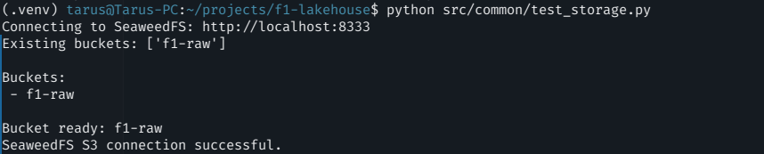
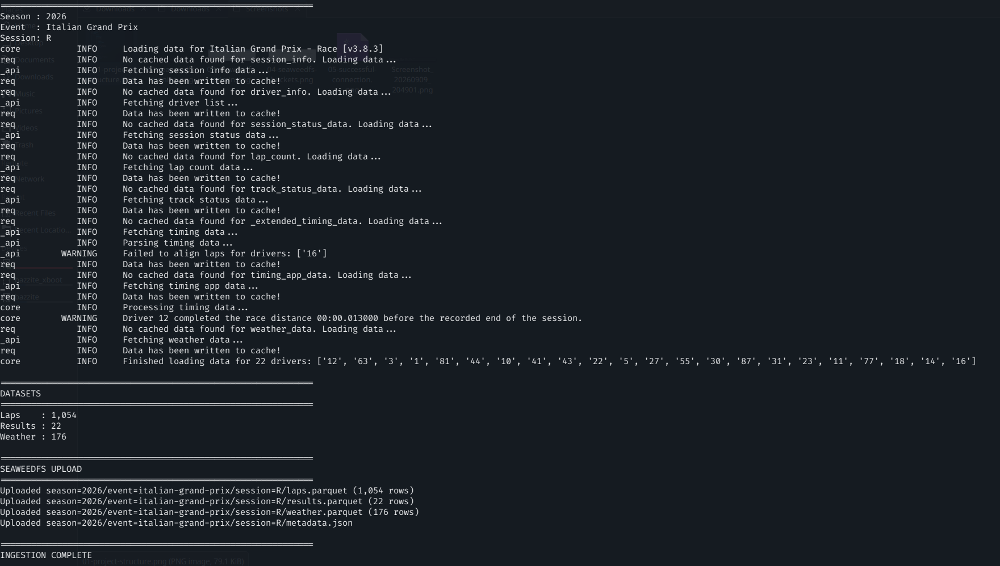
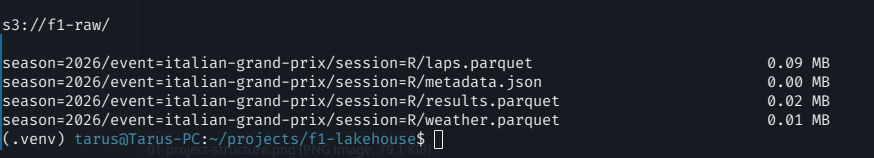
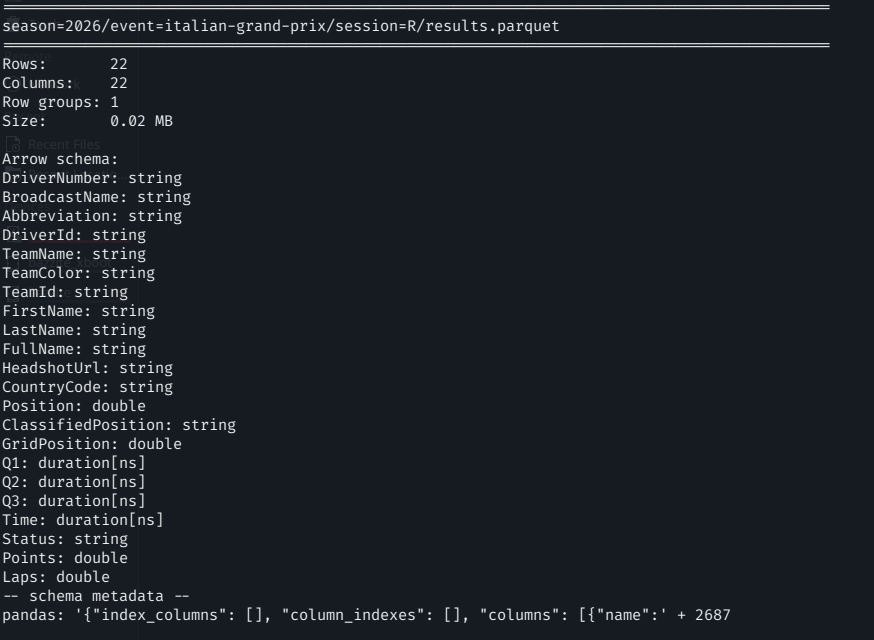
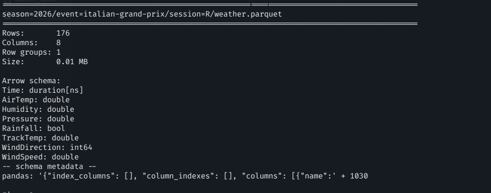
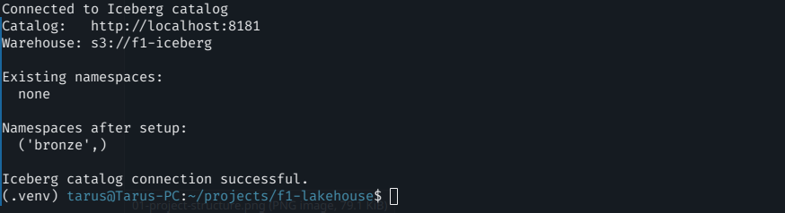
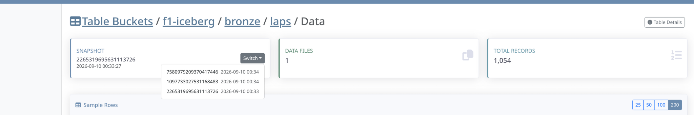
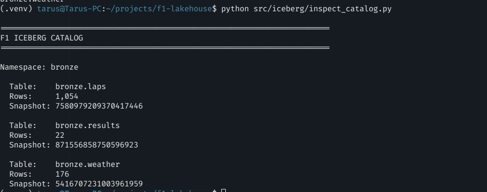

# 🏎️ F1 Lakehouse

An end-to-end open-source Formula 1 data platform built with **FastF1, SeaweedFS, Apache Iceberg, Trino, dbt, Apache Airflow, and Streamlit**.

The project treats Formula 1 data as a real data-engineering workload: race data is extracted from FastF1, landed as immutable Parquet in S3-compatible object storage, promoted into Iceberg tables, queried through Trino, transformed through Bronze/Silver/Gold layers with dbt, and orchestrated with Airflow.

## Architecture

```text
FastF1
   │
   ▼
Python ingestion
   │
   ▼
SeaweedFS ─────────────── Raw / landing zone
   │                     Parquet + JSON
   ▼
PyArrow / PyIceberg
   │
   ▼
Apache Iceberg ───────── Bronze tables
   │                     laps / results / weather / telemetry
   ▼
Trino
   │
   ▼
dbt ──────────────────── Silver + Gold transformations/tests
   │
   ▼
Streamlit

        Apache Airflow orchestrates the pipeline
```

## Stack

| Layer | Technology |
|---|---|
| Source | FastF1 |
| Ingestion | Python |
| Processing | Pandas / PyArrow |
| Object storage | SeaweedFS |
| File format | Parquet |
| Table format | Apache Iceberg |
| Iceberg client | PyIceberg |
| SQL query engine | Trino |
| Transformation | dbt Core + dbt-trino |
| Orchestration | Apache Airflow |
| Metadata database | PostgreSQL |
| Visualization | Streamlit |
| Containers | Podman / Compose |

## 1. S3-compatible storage with SeaweedFS

SeaweedFS provides the object-storage layer used for the raw landing zone and the Iceberg warehouse.


Python connectivity is validated through `boto3` before ingestion begins.



## 2. FastF1 ingestion

The ingestion layer extracts race/session data from FastF1 and writes Parquet plus metadata into a partitioned raw layout.

```text
f1-raw/
└── season=2026/
    └── event=italian-grand-prix/
        └── session=R/
            ├── laps.parquet
            ├── results.parquet
            ├── weather.parquet
            └── metadata.json
```



The resulting raw objects are visible directly in SeaweedFS.



## 3. Raw schema validation

Raw Parquet files are inspected before promotion so source types are understood before a Bronze contract is defined.

### Laps


### Results



### Weather



## 4. Apache Iceberg lakehouse layer

SeaweedFS exposes an Iceberg REST catalog and an Iceberg table bucket used by PyIceberg.



Bronze tables normalize source-oriented FastF1 fields into explicit analytical contracts while preserving lineage.


Iceberg snapshots make table state and idempotent overwrite behavior visible.



Catalog inspection confirms the registered Bronze tables and row counts.



## 5. Trino SQL layer

Trino provides the SQL compute layer over Iceberg while keeping compute separate from storage.


Bronze data can be queried directly through Trino.


Iceberg metadata tables expose snapshots and physical Parquet files through SQL.


## 6. Medallion modeling with dbt

The project uses a Bronze → Silver → Gold design.

```text
BRONZE
  normalized source data
      │
      ▼
SILVER
  validated / deduplicated / analysis-ready
      │
      ▼
GOLD
  application-ready analytical marts
```

Current models include:

```text
bronze.laps
bronze.results
bronze.weather
bronze.telemetry

silver.silver_laps
silver.silver_results
silver.silver_weather
silver.silver_telemetry

gold.race_driver_performance
gold.lap_telemetry_metrics
```

The Gold race-performance mart combines classification, starting position, finishing position, race pace, fastest lap, tyre metrics, and weather context.


## 7. Idempotency

Iceberg writes use partition-level overwrite rather than blind append. Reprocessing the same event/session/driver therefore replaces the existing logical partition instead of duplicating data.

```text
Run 1 → N rows
Run 2 → N rows ✅

not

Run 1 → N rows
Run 2 → 2N rows ❌
```

This design is important for retries and Airflow-driven reprocessing.

## 8. Airflow orchestration

The pipeline is orchestrated as a parameterized Airflow DAG.

```text
                         ingest_session
                              │
               ┌──────────────┼──────────────┐
               ▼              ▼              ▼
         promote_laps   promote_results  promote_weather
                              │
                       ingest_telemetry
                              │
                              ▼
                      promote_telemetry
               └──────────────┬──────────────┘
                              ▼
                       dbt_source_tests
                              │
                              ▼
                          dbt_build
                              │
                              ▼
                        validate_gold
```

Runtime parameters allow the same DAG to process different seasons, Grands Prix, and session types.

> Airflow DAG screenshot will be added in the next documentation update.

## Engineering decisions

The project intentionally separates responsibilities:

```text
SeaweedFS      → object storage
Apache Iceberg → table format + snapshots + metadata
Trino          → SQL compute
PyIceberg      → programmatic table writes
 dbt           → transformations + tests
Airflow        → orchestration
Streamlit      → serving / visualization
```

Other deliberate choices include explicit PyArrow schemas, immutable raw storage, replayability, partition-aware writes, composite-key duplicate tests, and pre-aggregated Gold telemetry marts to avoid repeatedly scanning high-frequency telemetry.

## Repository layout

```text
f1-lakehouse/
├── airflow/
│   └── dags/
├── app/
├── configs/
│   ├── dbt/
│   └── trino/
├── dbt/
│   ├── macros/
│   ├── models/
│   │   ├── bronze/
│   │   ├── silver/
│   │   └── gold/
│   └── tests/
├── docker/
├── docs/
│   └── screenshots/
├── src/
│   ├── common/
│   ├── iceberg/
│   ├── ingestion/
│   └── validation/
├── compose.yaml
├── requirements.txt
└── README.md
```

## Current milestone

The platform currently demonstrates:

- FastF1 race/session ingestion
- SeaweedFS S3-compatible raw storage
- Parquet schema inspection
- Iceberg REST catalog integration
- Bronze Iceberg tables
- Iceberg snapshots and idempotent writes
- Trino SQL access and Iceberg metadata queries
- dbt Silver and Gold modeling
- telemetry ingestion and analytical aggregation
- Airflow orchestration
- Streamlit serving layer

## Next improvements

The next engineering iterations are full-season orchestration/backfills, Airflow dynamic task mapping, Iceberg maintenance/compaction, CI with GitHub Actions, richer automated testing, and observability with Prometheus/Grafana.

## Author

**Robert Tarus**  
Data Engineer
