# 🏎️ F1 Lakehouse

An end-to-end open-source Formula 1 data platform built with **FastF1, SeaweedFS, Apache Iceberg, Trino, dbt, Apache Airflow, and Streamlit**.

The project treats Formula 1 data as a real data-engineering workload: race data is extracted from FastF1, landed as immutable Parquet in S3-compatible object storage, promoted into Iceberg tables, queried through Trino, transformed through Bronze/Silver/Gold layers with dbt, and orchestrated with Airflow.

## Architecture

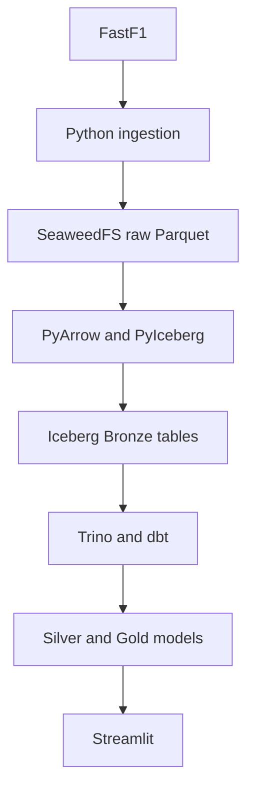

Airflow orchestrates ingestion, promotion, transformation, and validation. Iceberg data files are stored in SeaweedFS; the diagram shows the logical data flow.

## Stack

| Layer | Technology |
|---|---|
| Source | FastF1 |
| Ingestion | Python |
| Processing | Pandas / PyArrow |
| Object storage | SeaweedFS |
| File format | Parquet |
| Table format | Apache Iceberg |
| Iceberg client | PyIceberg |
| SQL query engine | Trino |
| Transformation | dbt Core + dbt-trino |
| Orchestration | Apache Airflow |
| Metadata database | PostgreSQL |
| Visualization | Streamlit |
| Containers | Podman / Compose |

## Project foundation

### Initial project structure

The initial workspace separates configuration, ingestion code, storage data, documentation, and tests. This screenshot captures an early project stage.

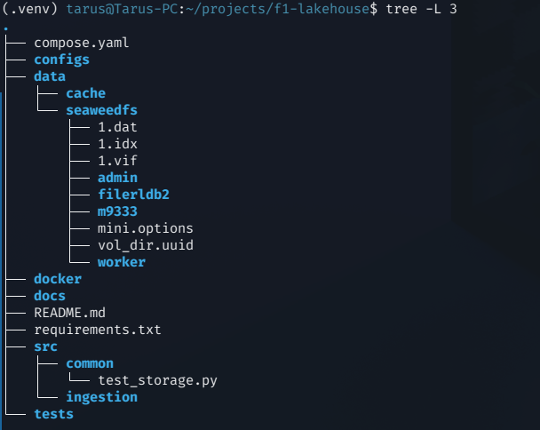

## 1. S3-compatible storage with SeaweedFS

SeaweedFS provides the object-storage layer used for the raw landing zone and the Iceberg warehouse.

### Storage service running

The container listing shows the SeaweedFS service running with its exposed ports.


### Raw storage bucket

The SeaweedFS filer lists the `f1-raw` bucket.

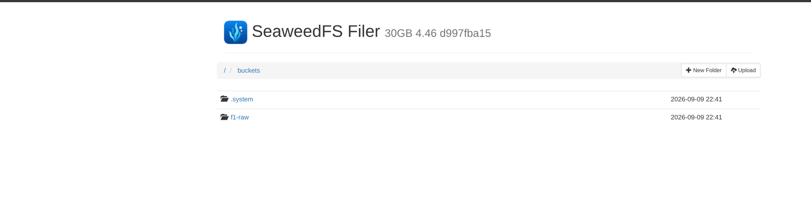


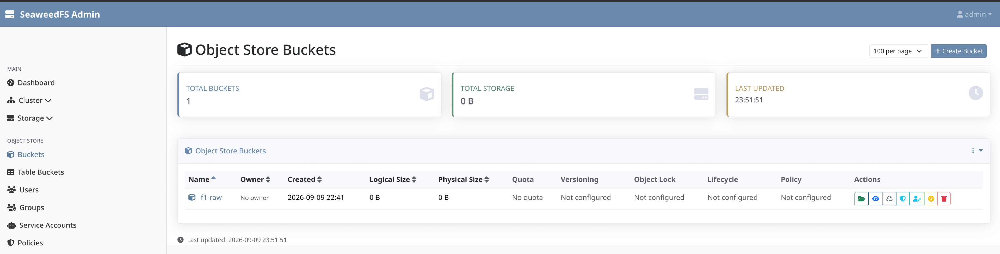

*SeaweedFS Admin showing the raw object-store bucket.*

Python connectivity is validated through `boto3` before ingestion begins.


*Python storage check confirming S3 connectivity and the raw bucket.*

## 2. FastF1 ingestion

The ingestion layer extracts race/session data from FastF1 and writes Parquet plus metadata into a partitioned raw layout.

```text
f1-raw/
└── season=2026/
    └── event=italian-grand-prix/
        └── session=R/
            ├── laps.parquet
            ├── results.parquet
            ├── weather.parquet
            └── metadata.json
```


*FastF1 extraction log and uploaded session objects.*

The resulting raw objects are visible directly in SeaweedFS.


*Raw Parquet and JSON object paths grouped by season, event, and session.*

### Raw objects in the storage browser

The session partition contains laps, results, weather, and metadata objects in the SeaweedFS browser.

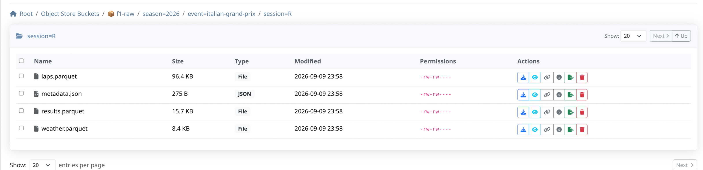

## 3. Raw schema validation

Raw Parquet files are inspected before promotion so source types are understood before a Bronze contract is defined.

### Laps

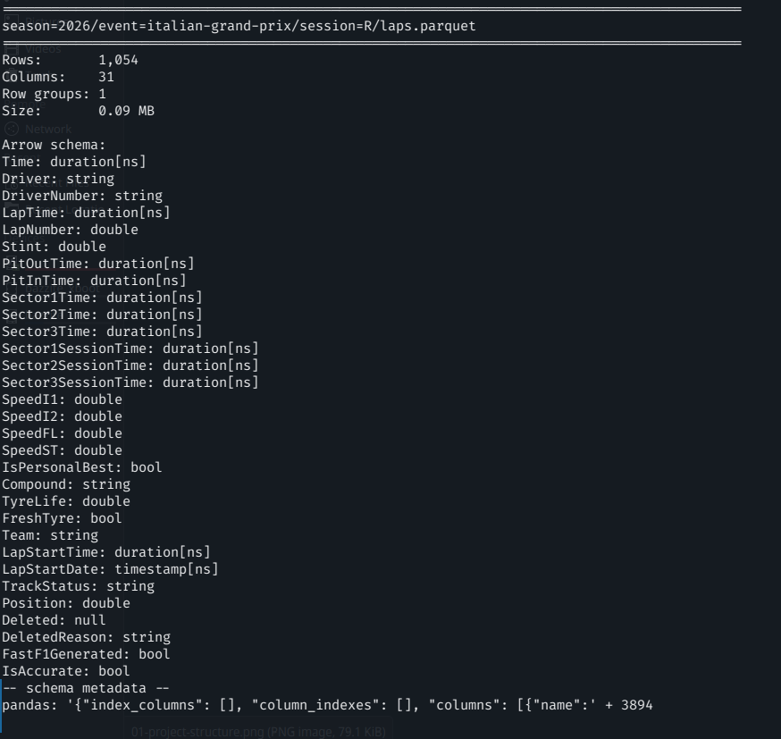

*Parquet metadata and Arrow field types for the raw laps dataset.*

### Results


*Parquet metadata and Arrow field types for the raw results dataset.*

### Weather


*Parquet metadata and Arrow field types for the raw weather dataset.*

## 4. Apache Iceberg lakehouse layer

SeaweedFS exposes an Iceberg REST catalog and an Iceberg table bucket used by PyIceberg.


*Successful REST catalog connection and Bronze namespace setup.*

Bronze tables normalize source-oriented FastF1 fields into explicit analytical contracts while preserving lineage.

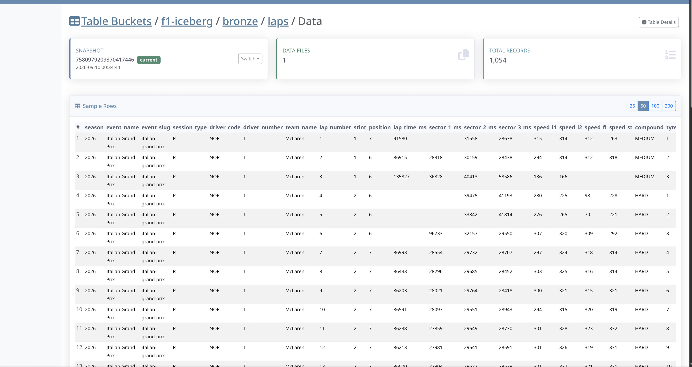

*Bronze laps table data visible in the Iceberg table browser.*

Iceberg snapshots make table state and idempotent overwrite behavior visible.

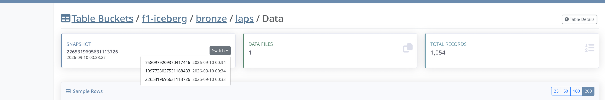

*Snapshot selector and record count for the Bronze laps table.*

Catalog inspection confirms the registered Bronze tables and row counts.


*Programmatic catalog inspection with Bronze table row counts and snapshot identifiers.*

## 5. Trino SQL layer

Trino provides the SQL compute layer over Iceberg while keeping compute separate from storage.

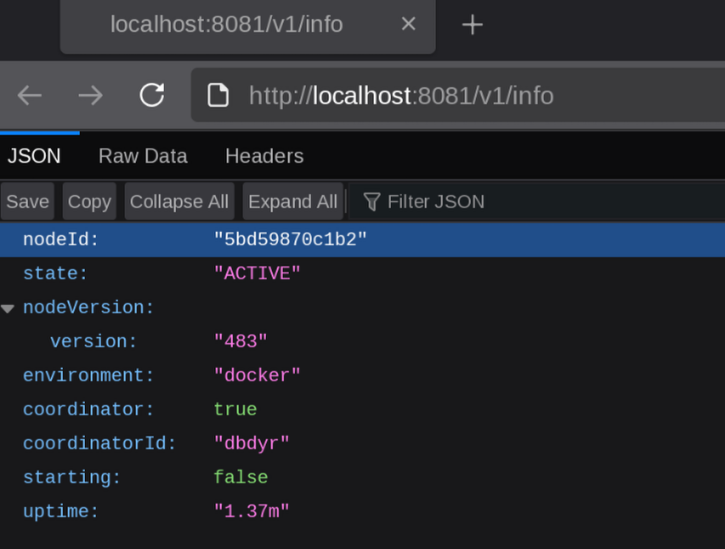

*Trino information endpoint showing an active coordinator.*

Bronze data can be queried directly through Trino.

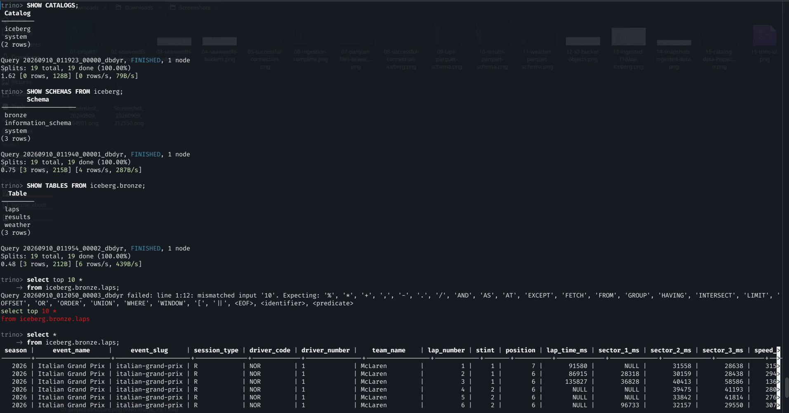

*Trino catalog and schema discovery followed by sample Bronze lap rows.*

Iceberg metadata tables expose snapshots and physical Parquet files through SQL.

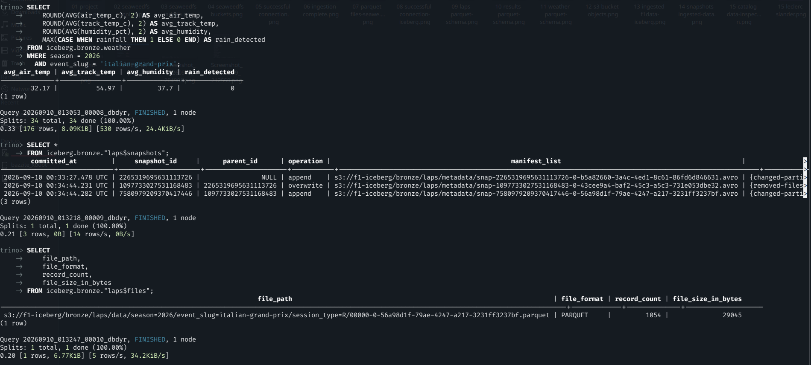

*Weather aggregation and Iceberg snapshot/file metadata queried through Trino.*

### Lap counts by driver

A grouped Trino query counts recorded laps per driver. Differences in recorded laps are visible in the result; the original filename is retained.

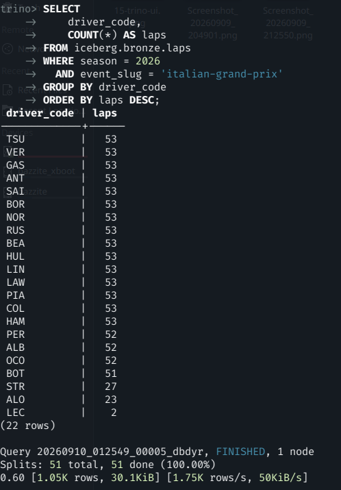

## 6. Medallion modeling with dbt

The project uses a Bronze → Silver → Gold design.

| Layer | Purpose |
|---|---|
| Bronze | Normalized source data |
| Silver | Validated, deduplicated, analysis-ready data |
| Gold | Application-ready analytical marts |

Current models include:

```text
bronze.laps
bronze.results
bronze.weather
bronze.telemetry

silver.silver_laps
silver.silver_results
silver.silver_weather
silver.silver_telemetry

gold.race_driver_performance
gold.lap_telemetry_metrics
```

The Gold race-performance mart combines classification, starting position, finishing position, race pace, fastest lap, tyre metrics, and weather context.

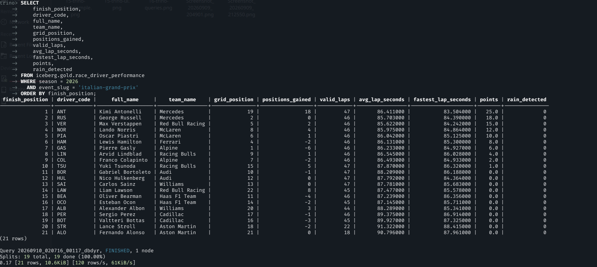

*Gold race-driver performance query output, including position and pace metrics.*

## 7. Idempotency

Iceberg writes use partition-level overwrite rather than blind append. Reprocessing the same event/session/driver therefore replaces the existing logical partition instead of duplicating data.

Expected invariant: after reprocessing the same logical partition, the row count remains **N**, rather than increasing to **2N**.

This design is important for retries and Airflow-driven reprocessing.

### Telemetry row-count inspection

A Trino query reports the telemetry row count for HAM in the selected session. This image shows a count at one point in time; a before-and-after comparison is needed to independently demonstrate idempotency.

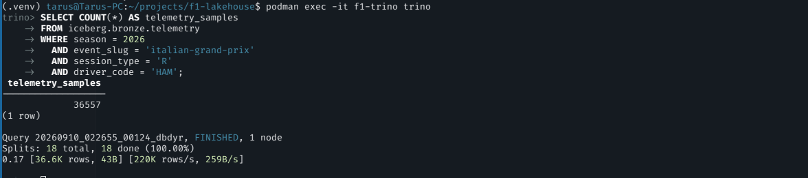

## Telemetry ingestion and coverage

### Driver telemetry ingestion

The ingestion log shows drivers being processed and telemetry Parquet objects written to driver-specific raw paths.

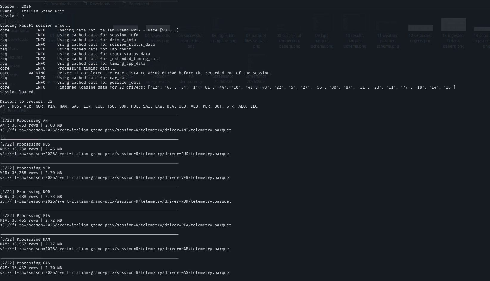

### Telemetry coverage across the grid

SQL results show per-driver sample counts and an aggregate check of driver coverage and speed values.

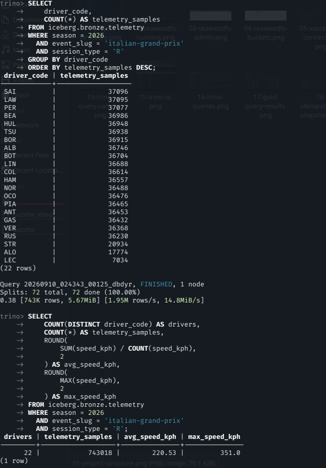

## Streamlit analytics

### Race overview and classification

The Streamlit application presents session selectors, race summary values, and a classification table from the analytical serving layer.

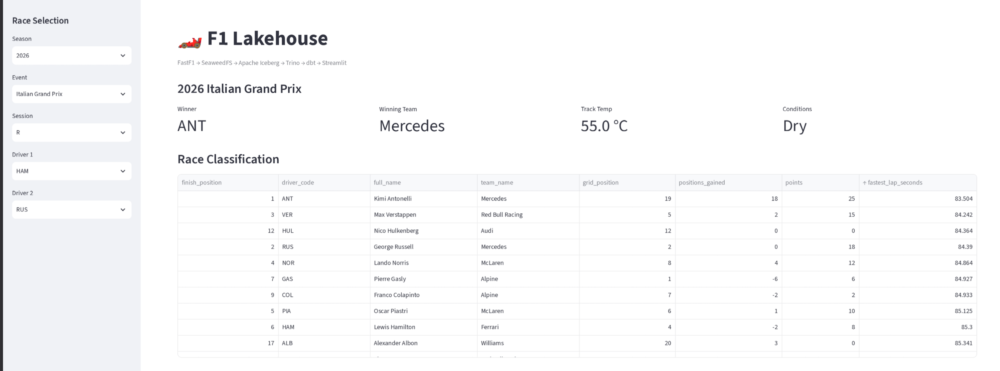

### Hamilton and Russell comparison

The dashboard compares HAM and RUS using lap-time and maximum-speed-by-lap plots.

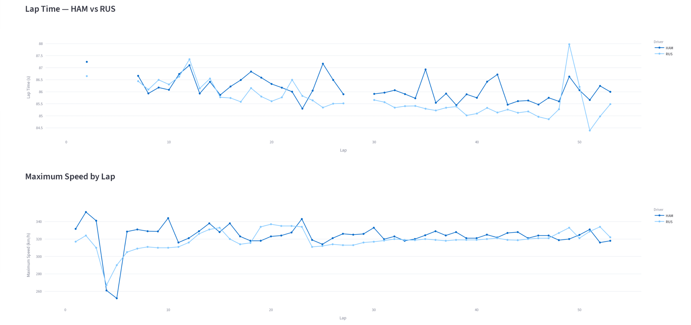

## 8. Airflow orchestration

The pipeline is orchestrated as a parameterized Airflow DAG.

### Registered Airflow pipeline

The Airflow DAG listing shows `f1_lakehouse_pipeline`. This capture documents registration; the subsequent screenshot shows a successful run.

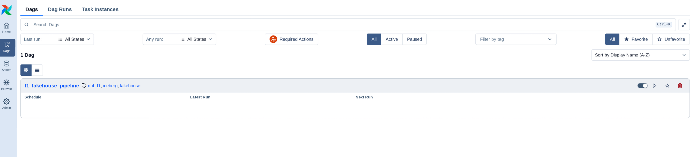


The recorded run includes session ingestion, promotion of laps/results/weather, telemetry ingestion and promotion, dbt source tests, dbt build, and Gold validation.

Runtime parameters allow the same DAG to process different seasons, Grands Prix, and session types.

The following run shows the complete DAG finishing successfully, including `ingest_session`, telemetry ingestion and promotion, dbt source tests/build, and final Gold-layer validation.

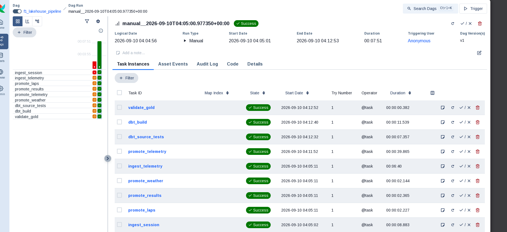

*Successful Airflow run with ingestion, promotion, dbt, and Gold-validation tasks.*

## Engineering decisions

The project intentionally separates responsibilities:

| Component | Responsibility |
|---|---|
| SeaweedFS | Object storage |
| Apache Iceberg | Table format, snapshots, and metadata |
| Trino | SQL compute |
| PyIceberg | Programmatic table writes |
| dbt | Transformations and tests |
| Airflow | Orchestration |
| Streamlit | Serving and visualization |

Other deliberate choices include explicit PyArrow schemas, immutable raw storage, replayability, partition-aware writes, composite-key duplicate tests, and pre-aggregated Gold telemetry marts to avoid repeatedly scanning high-frequency telemetry.

## Repository layout

```text
f1-lakehouse/
├── airflow/
│   └── dags/
├── app/
├── configs/
│   ├── dbt/
│   └── trino/
├── dbt/
│   ├── macros/
│   ├── models/
│   │   ├── bronze/
│   │   ├── silver/
│   │   └── gold/
│   └── tests/
├── docker/
├── docs/
│   └── screenshots/
├── src/
│   ├── common/
│   ├── iceberg/
│   ├── ingestion/
│   └── validation/
├── compose.yaml
├── requirements.txt
└── README.md
```

## Current milestone

The platform currently demonstrates:

- FastF1 race/session ingestion
- SeaweedFS S3-compatible raw storage
- Parquet schema inspection
- Iceberg REST catalog integration
- Bronze Iceberg tables
- Iceberg snapshots and idempotent writes
- Trino SQL access and Iceberg metadata queries
- dbt Silver and Gold modeling
- telemetry ingestion and analytical aggregation
- Airflow orchestration
- Streamlit serving layer

## Next improvements

The next engineering iterations are full-season orchestration/backfills, Airflow dynamic task mapping, Iceberg maintenance/compaction, CI with GitHub Actions, richer automated testing, and observability with Prometheus/Grafana.

## Author

**Robert Tarus**  
Data Engineering · Analytics Engineering · Data Platforms

## Screenshot inventory

All **29 supplied PNG files** are included in this documentation package: **27 distinct images** and **2 byte-identical copies**. Filenames are preserved exactly, including the repeated `15-` prefixes. All image links are relative to this README at the repository root.

<details>
<summary>Original duplicate captures (2 files)</summary>

### Original container-status capture

Byte-identical to `02-seaweedfs-running.png`; retained to account for every supplied file.

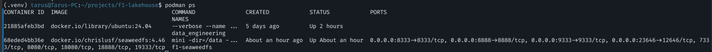

### Original laps-schema capture

Byte-identical to `09-laps-parquet-schema.png`; retained to account for every supplied file.


</details>

| File | Included |
|---|---|
| [01-project-structure.png](docs/screenshots/01-project-structure.png) | Yes |
| [02-seaweedfs-running.png](docs/screenshots/02-seaweedfs-running.png) | Yes |
| [03-seaweedfs-admin.png](docs/screenshots/03-seaweedfs-admin.png) | Yes |
| [04-seaweedfs-buckets.png](docs/screenshots/04-seaweedfs-buckets.png) | Yes |
| [05-successful-connection.png](docs/screenshots/05-successful-connection.png) | Yes |
| [06-ingestion-complete.png](docs/screenshots/06-ingestion-complete.png) | Yes |
| [07-parquet-files-seaweedfs.png](docs/screenshots/07-parquet-files-seaweedfs.png) | Yes |
| [08-successful-connection-iceberg.png](docs/screenshots/08-successful-connection-iceberg.png) | Yes |
| [09-laps-parquet-schema.png](docs/screenshots/09-laps-parquet-schema.png) | Yes |
| [10-results-parquet-schema.png](docs/screenshots/10-results-parquet-schema.png) | Yes |
| [11-weather-parquet-schema.png](docs/screenshots/11-weather-parquet-schema.png) | Yes |
| [12-s3-bucket-objects.png](docs/screenshots/12-s3-bucket-objects.png) | Yes |
| [13-ingested-f1data-iceberg.png](docs/screenshots/13-ingested-f1data-iceberg.png) | Yes |
| [14-snapshots-ingested-data.png](docs/screenshots/14-snapshots-ingested-data.png) | Yes |
| [15-catalog-data-inspection.png](docs/screenshots/15-catalog-data-inspection.png) | Yes |
| [15-leclerc-slander.png](docs/screenshots/15-leclerc-slander.png) | Yes |
| [15-trino-query-sample.png](docs/screenshots/15-trino-query-sample.png) | Yes |
| [15-trino-ui.png](docs/screenshots/15-trino-ui.png) | Yes |
| [16-trino-queries.png](docs/screenshots/16-trino-queries.png) | Yes |
| [17-gold-query-results.png](docs/screenshots/17-gold-query-results.png) | Yes |
| [18-idempotency-snapshot.png](docs/screenshots/18-idempotency-snapshot.png) | Yes |
| [19-ingesting-telemetry.png](docs/screenshots/19-ingesting-telemetry.png) | Yes |
| [20-full-grid-telemetry.png](docs/screenshots/20-full-grid-telemetry.png) | Yes |
| [21-streamlit-plots.png](docs/screenshots/21-streamlit-plots.png) | Yes |
| [22-ham-russ-telemetry.png](docs/screenshots/22-ham-russ-telemetry.png) | Yes |
| [23-dag-pipeline.png](docs/screenshots/23-dag-pipeline.png) | Yes |
| [24-successful-dag-trigger-run.png](docs/screenshots/24-successful-dag-trigger-run.png) | Yes |
| [Screenshot_20260909_204901.png](docs/screenshots/Screenshot_20260909_204901.png) | Yes |
| [Screenshot_20260909_212550.png](docs/screenshots/Screenshot_20260909_212550.png) | Yes |
